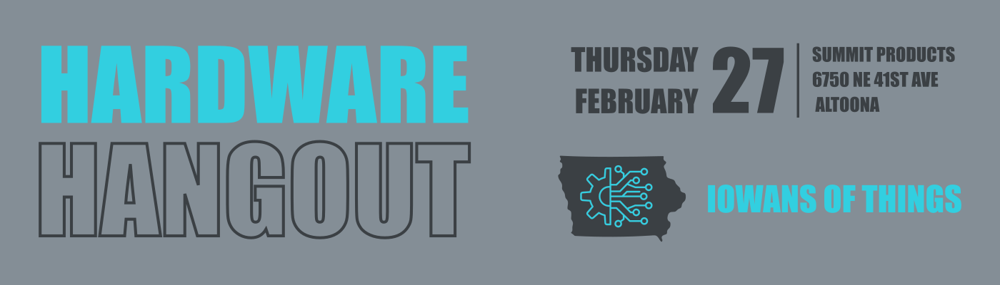
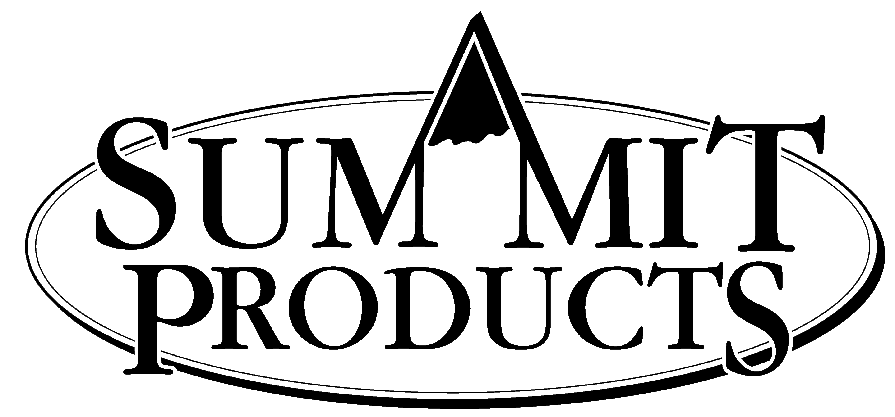

---

layout: post
title: Hardware Hangout - February 2025
date: 2025-02-27 00:30:00 -0600
categories: [event, hardware_hangout, past]
excerpt_separator: <!--more-->
permalink: /hh-february-2025

---

**Date:**  February 27th, 2025

**Time:**  4:30 PM - 6:30 PM

**Place:** Summit Products: 6750 NE 41st Ave, Altoona, IA, 50009

Help us kick off the first Hardware Hangout of 2025 by joining us at Summit Products in Altoona, IA.

The theme for this Hardware Hangout event is all things non-consumer IoT. Topics will include building and factory automation and the control systems that go into it. Stick around to get a tour of the Summit Products factory hosted by our gracious sponsor!

{:width="250px"}

Registration below.

<!--more-->  
<!--the above "comment" tells the main page where to put the break-->

### Event Highlights

- **Technical Talk:** Learn and share about non-consumer IoT topics.
- **Networking:** Mingle with like-minded individuals, share experiences, and forge valuable connections.
- **Project Share:** Bring your latest projects or ideas to spur conversations, or simply be inspired by others. Don’t worry, we won’t make anyone perform a show-and-tell!

{:height="250px" width="250px"}

### Who Should Come?

- Embedded software developers
- Firmware developers
- Electronics and electrical engineers
- Electronics and robotics hobbyists
- Product designers
- Automation engineers and techs
- Supporters of the industry
- Those looking to work in or hire people in the industry

### Event Agenda

- 4:30 - Arrive, park, grab refreshments
- 5:00 - Tech Talk & Open Discussion: non-consumer IoT
- 5:30 - Plant Tour 
- 5:45 - Share projects and mingle
- 6:30 - Wrap up and take off

### Reserve Your Spot

RSVP in the link below!

  

## Sponsors

Many thanks to our sponsors!

{:width="250px"}
[DISTek Integration, Inc.](https://distek.com/)

  
{:width="250px"}
[Stone Path Engineering, LLC](https://stonepathengineering.com/)

  
{:width="250px"}
[Summit Products](https://www.summit-products.com/)
