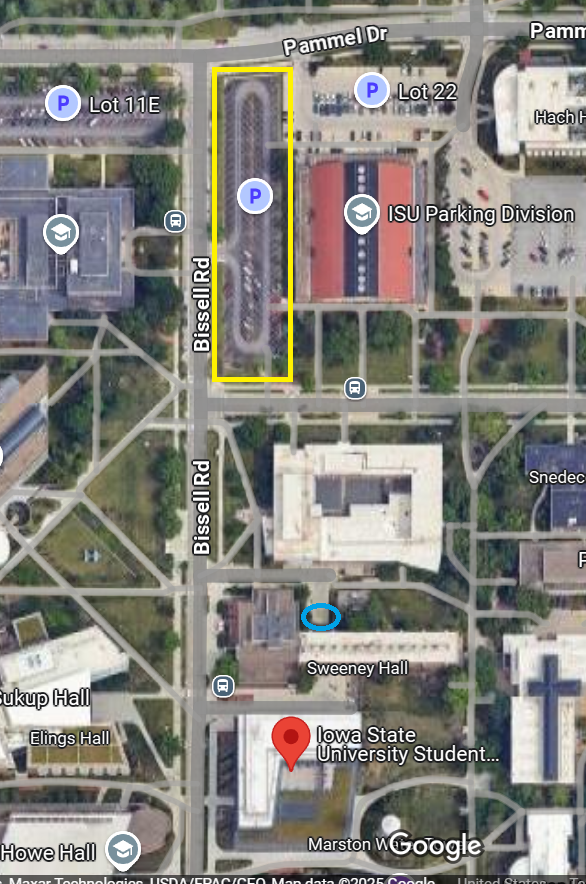

---

layout: post
title: Hardware Hangout - September 2025
date: 2024-05-29 00:30:00 -0600
categories: [event, hardware_hangout, next]
excerpt_separator: <!--more-->
permalink: /hh-sept-2025

---

**Date:**  September 18th, 2025

**Time:**  4:30 PM - 6:30 PM

**Place:** Student Innovation Center (SIC) - 606 Bissell Rd, Ames, IA 50011

Join us for the upcoming Hardware Hangout at the Iowa State University Student Innovation Center (SIC) in Ames, IA!

Just like last year, this Hardware Hangout will focus on careers in embedded systems. In addition to our incredible Iowans of Things members, ISU students are also encouraged to attend. Come ready to share your career path, aspirations, or experiences in the embedded space. Plus, don’t miss the opportunity to tour the Student Innovation Center (SIC)!

{:width="250px"}

Registration below.

<!--more-->  
<!--the above "comment" tells the main page where to put the break-->

### Event Highlights

- **Technical Talk:** Career journey in embedded systems. 
- **SIC Tour:** Get the opportunity to tour the Student Innovation Center to see what the next generation of professionals are working on!
- **Networking:** Mingle with like-minded individuals, share experiences, and forge valuable connections.
- **Project Share:** Bring your latest projects or ideas to spur conversations, or simply be inspired by others. Don’t worry, we won’t make anyone perform a show-and-tell!

{:height="250px" width="250px"}

### Who Should Come?

- Embedded software developers
- Firmware developers
- Electronics and electrical engineers
- Electronics and robotics hobbyists
- Product designers
- Automation engineers and techs
- Supporters of the industry
- Those looking to work in or hire people in the industry
-Students wanting to learn more

### Event Agenda

- 4:30 - Arrive, park, grab refreshments
- 5:00 - Tech Talk & Open Discussion: Embedded Careers
- 5:45 - SIC Tour and mingle
- 6:30 - Wrap up and take off

### Reserve Your Spot

RSVP in the link below!

  

## Sponsors

Many thanks to our sponsors!

{:width="250px"}
[DISTek Integration, Inc.](https://distek.com/)

  
{:width="250px"}
[Stone Path Engineering, LLC](https://stonepathengineering.com/)

  
{:width="250px"}
[Iowa SBDC](http://www.iowasbdc.org/)

## Parking 

Metered parking is available in Lot 21, marked with the yellow rectangle. Two handicapped spaces are available north of Sweeney Hall, marked with the blue circle. For more information, see: https://www.parking.iastate.edu/visitor 

The Student Innovation Center (SIC), where the event is held, is located a couple of blocks down from the parking lot, (see red pin in picture below). 

