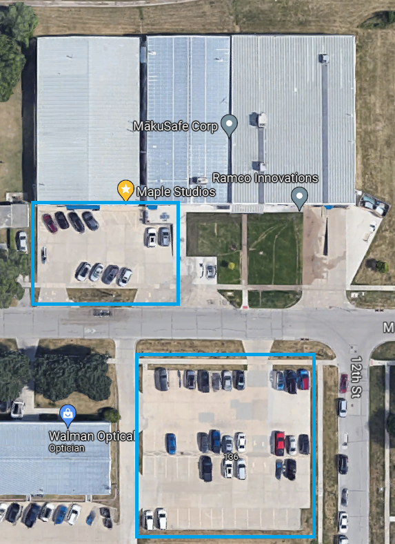

---

layout: post
title: Hardware Hangout - September 2025
date: 2024-05-29 00:30:00 -0600
categories: [event, hardware_hangout, next]
excerpt_separator: <!--more-->
permalink: /hh-sept-2025

---

![Banner] (../assets/images/banner_hardware_hangout_2025_09.png)

**Date:**  September 18th, 2025

**Time:**  4:30 PM - 6:30 PM

**Place:** Student Innovation Center (SIC) - 606 Bissell Rd, Ames, IA 50011

Join us for the upcoming Hardware Hangout at the Iowa State University Student Innovation Center (SIC) in Ames, IA!

Similar to last year, the theme for this Hardware Hangout event will be informational about careers in embedded systems. Along with our awesome Iowans of Things members, ISU students are also welcome to attend. Come prepared to chat about your career, your aspirations, or your journey in the embedded space. 

{:width="250px"}

Registration below.

<!--more-->  
<!--the above "comment" tells the main page where to put the break-->

### Event Highlights

- **Technical Talk:** Career journey in embedded systems. 
- **Networking:** Mingle with like-minded individuals, share experiences, and forge valuable connections.
- **Project Share:** Bring your latest projects or ideas to spur conversations, or simply be inspired by others. Don’t worry, we won’t make anyone perform a show-and-tell!

{:height="250px" width="250px"}

### Who Should Come?

- Embedded software developers
- Firmware developers
- Electronics and electrical engineers
- Electronics and robotics hobbyists
- Product designers
- Automation engineers and techs
- Supporters of the industry
- Those looking to work in or hire people in the industry
-Students wanting to learn more

### Event Agenda

- 4:30 - Arrive, park, grab refreshments
- 5:00 - Tech Talk & Open Discussion: Embedded Careers
- 5:45 - Share projects and mingle
- 6:30 - Wrap up and take off

### Reserve Your Spot

RSVP in the link below!
 

  

## Sponsors

Many thanks to our sponsors!

{:width="250px"}
[DISTek Integration, Inc.](https://distek.com/)

  
{:width="250px"}
[Stone Path Engineering, LLC](https://stonepathengineering.com/)

  
{:width="250px"}
[Surge Law](https://surge.law/)

## Parking 

Off-street parking is available in the Maple Studios parking lots, shown below. Additional parking can be found at the city lot at 14th and Maple. Please do not park in the grass. 

Use the door nearest the overhead doors to enter the building.

