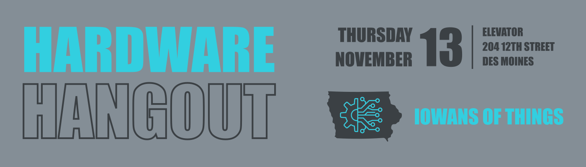

---

layout: post
title: Hardware Hangout - November 2025
date: 2025-09-21 00:30:00 -0600
categories: [event, hardware_hangout, next]
excerpt_separator: <!--more-->
permalink: /hh-november-2025

---

**Date:**  November 13th, 2025

**Time:**  4:30 PM - 6:30 PM

**Place:** Elevator, 204 12th St, Des Moines, IA 50309

Join us for the November Hardware Hangout! This networking event brings together embedded developers, electronics engineers, hobbyists, and industry supporters for technical discussions and community building.

The topic for the November Hardware Hangout is After the Release. 

Once you've made it through prototyping, development, manufacturing, and selling your product, kick back and celebrate your achievement! But not for too long because you're not done! A whole new set of decisions to make and challenges to overcome await you. Warehousing and shipping, returns and customer support, bug fixes, updates and new features. It's almost another whole job! 

Share your stories, tips, and questions with the group! 

{:width="250px"}

Registration below.

<!--more-->  
<!--the above "comment" tells the main page where to put the break-->

### Event Highlights

- **Technical Talk:** After the Release
- **Networking:** Mingle with like-minded individuals, share experiences, and forge valuable connections
- **Project Share:** Bring your latest projects or ideas to spur conversations, or simply be inspired by others. Don't worry, we won't make anyone perform a show-and-tell!

{:height="250px" width="250px"}

### Who Should Come?

- Embedded software developers
- Firmware developers
- Electronics and electrical engineers
- Electronics and robotics hobbyists
- Product designers
- Automation engineers and techs
- Supporters of the industry
- Those looking to work in or hire people in the industry

### Event Agenda

- 4:30 - Arrive, park, grab refreshments
- 5:00 - Tech Talk & Open Discussion
- 5:45 - Share projects and mingle
- 6:30 - Wrap up and take off

### Reserve Your Spot

RSVP in the link below!

  

## Sponsors

Many thanks to our sponsors!
{:width="250px"}
[Elevator](https://www.elevatorspaces.com/des-moines)

{:width="250px"}
[DISTek Integration, Inc.](https://distek.com/)

  
{:width="250px"}
[Spark Embedded, LLC](https://sparkembedded.com/)