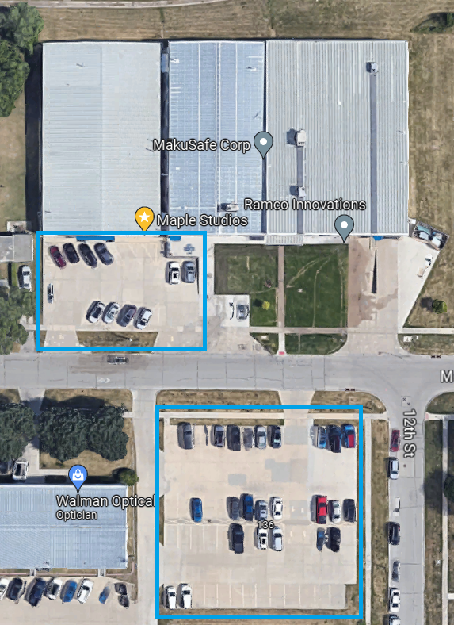

---

layout: post
title: Hardware Hangout - February 2026
date: 2026-01-13 00:30:00 -0600
categories: [event, hardware_hangout, next]
excerpt_separator: <!--more-->
permalink: /hh-february-2026

---

**Date:**  February 26th, 2026

**Time:**  4:30 PM - 6:30 PM

**Place:** Maple Studios, 1207 Maple Street, West Des Moines, IA

Join us for the first Hardware Hangout of the 2026 season! This networking event brings together embedded developers, electronics engineers, hobbyists, and industry supporters for technical discussions and community building.

The topic for the February Hardware Hangout is Project Share.

Join us for a collaborative event where attendees can reflect on what they worked on throughout 2025. We'll celebrate wins, talk through challeneges, and share lessons learned across projects of all shapes and sizes. Whether you're proud of a breakthrough, learned something the hard way, or just want to hear what other's worked on this past year, this is a great opportunity to connect, learn, and grow our Iowans of Things community!

Share your stories, tips, and questions with the group! 

{:width="250px"}

Registration below.

<!--more-->  
<!--the above "comment" tells the main page where to put the break-->

### Event Highlights

- **Technical Talk:** 2025 Project Share
- **Networking:** Mingle with like-minded individuals, share experiences, and forge valuable connections
- **Project Share:** Bring your latest projects or ideas to spur conversations, or simply be inspired by others. Don't worry, we won't make anyone perform a show-and-tell!

{:height="250px" width="250px"}

### Who Should Come?

- Embedded software developers
- Firmware developers
- Electronics and electrical engineers
- Electronics and robotics hobbyists
- Product designers
- Automation engineers and techs
- Supporters of the industry
- Those looking to work in or hire people in the industry

### Event Agenda

- 4:30 - Arrive, park, grab refreshments
- 5:00 - Tech Talk & Open Discussion
- 5:45 - Share projects and mingle
- 6:30 - Wrap up and take off

### Reserve Your Spot

RSVP in the link below!

  

## Sponsors

Many thanks to our sponsors!

<table>
<tr>
    <td>
        
    </td>
    <td>
        
    </td>
    <td>
        
    </td>
</tr>
    <td>
        
    </td>
    <td>
        
    </td>
    <td>
        
    </td>
</table>

  

## Parking 

Off-street parking is available in the Maple Studios parking lots, shown below. Additional parking can be found at the city lot at 14th and Maple. Please do not park in the grass. 

Use the door nearest the overhead doors to enter the building.

