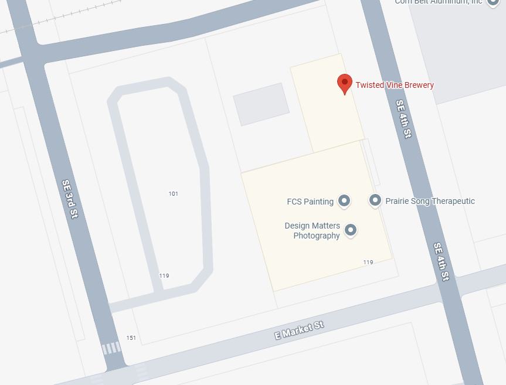

---

layout: post
title: Hardware Hangout - May 2026
date: 2026-01-13 00:30:00 -0600
categories: [event, hardware_hangout, next]
excerpt_separator: <!--more-->
permalink: /hh-may-2026

---

**Date:**  May 14th, 2026

**Time:**  4:30 PM - 6:30 PM

**Place:** 112 SE 4th St, Des Moines, IA 50309

Join us for the May Hardware Hangout on May 14th! This networking event brings together embedded developers, electronics engineers, hobbyists, and industry supporters for technical discussions and community building.

The topic for the February Hardware Hangout is AI in IoT.

AI, especially LLMs (Large Language Models), have been in the news daily. So we wanted to hear the experiences of the Iowans of Things community. Are you using an LLM on your projects? How about other machine learning or artificial intelligence algorithms? Tell us the good, the bad, and the ugly! And if you haven't used AI in any way, let us know that, too! 

Share your stories, tips, and questions with the group! 

{:width="250px"}

Registration below.

<!--more-->  
<!--the above "comment" tells the main page where to put the break-->

### Event Highlights

- **Technical Talk:** AI in IoT
- **Networking:** Mingle with like-minded individuals, share experiences, and forge valuable connections
- **Project Share:** Bring your latest projects or ideas to spur conversations, or simply be inspired by others. Don't worry, we won't make anyone perform a show-and-tell!

{:height="250px" width="250px"}

### Who Should Come?

- Embedded software developers
- Firmware developers
- Electronics and electrical engineers
- Electronics and robotics hobbyists
- Product designers
- Automation engineers and techs
- Supporters of the industry
- Those looking to work in or hire people in the industry

### Event Agenda

- 4:30 - Arrive, park, grab refreshments
- 5:00 - Tech Talk & Open Discussion
- 5:45 - Share projects and mingle
- 6:30 - Wrap up and take off

### Reserve Your Spot

RSVP in the link below!

  

## Sponsors

Many thanks to our sponsors!

<table>
<tr>
    <td>
        
    </td>
    <td>
        
    </td>
    <td>
        
    </td>
</tr>
    <td>
        
    </td>
    <td>
        
    </td>
    <td>
        
    </td>
</table>

  

## Parking 

Off-street parking is available on SE 4th St., and E Market St. Additional parking can be found behind the building in the lot, see below. 

