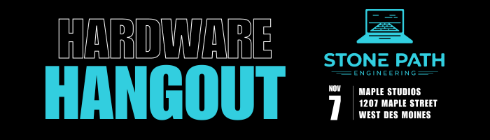

---

layout: homepage
title: Home

---

## Inaugural Event

**Date:**  November 7th, 2023

**Time:**  4:30 PM - 6:30 PM

**Place:** Maple Studios, 1207 Maple Street, West Des Moines

Join us at our first Hardware Hangout, where you can meet and connect with fellow enthusiasts and professionals in the industry.

### Event Highlights

- **Explore Maple Studios:** Take a guided tour of the state-of-the-art Maple Studios, a hub for innovation in the tech world.
- **Networking:** Mingle with like-minded individuals, share experiences, and forge valuable connections.
- **Project Share:** Bring your latest projects or ideas to spur conversations, or simply be inspired by others. Don’t worry, we won’t make anyone perform a show-and-tell!

{:height="250px" width="250px"}

### Who Should Come?

- Firmware developers
- Electronics and electrical engineers
- Electronics and robotics hobbyists
- Product designers
- Supporters of the industry
- Those looking to work in or hire people in the industry

### Event Agenda

- 4:30 - arrive, park, grab refreshments
- 5:00 - event kick-off and short welcome
  - Optional tours of Maple Studios
  - Share projects and mingle
- 6:30 - wrap up and take off

### Reserve Your Spot

Don't miss out. RSVP today and secure your spot for an evening of networking, inspiration, and fun.

   

## Sponsors

Many thanks to our sponsors!

{:width="250px"}
[DISTek Integration, Inc.](https://distek.com/)

  
{:width="250px"}
[Maple Studios](https://www.maplestudios.com/)
